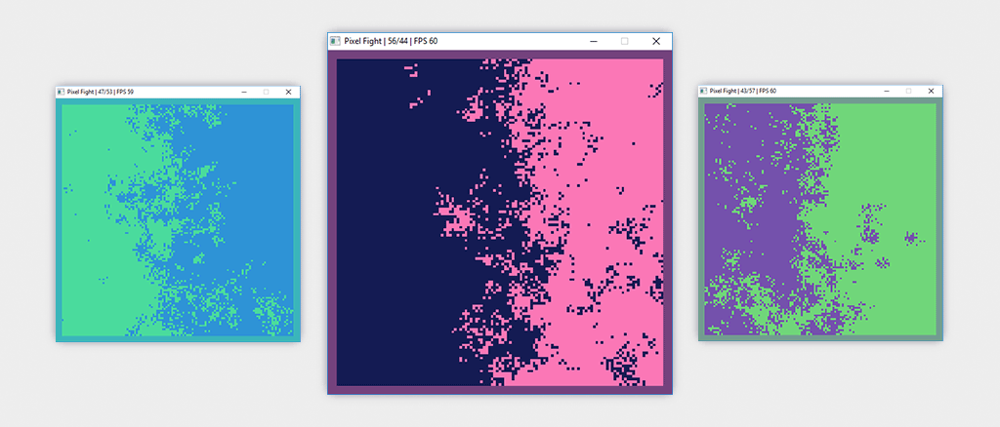

<h1 align="center">Go Pixels Fight!</h1>

<em>A Golang port of <a href="http://pixelsfighting.com/">pixelsfighting.com</a></em>

  
  

## About

This ia port to Go of the JavaScript [Pixel Fighting](http://pixelsfighting.com/) simulation by [Jan Tewes Thede](https://twitter.com/jtthede). There are a few notable differences between Jan's version and my port, namely mine contains a positive feedback loop so that once one side begins to gain ground their velocity increases until a winner in found rather than oscillating between the two sides. Once a side has one the simulation resets and a fresh pair of colours are selected.

In addition to the above this port also includes a border around the _"battle field"_ that is shaded in preference to the winning side.

## Building

This application depends upon [faiface/pixel](https://github.com/faiface/pixel) which lists its [requirements here](https://github.com/faiface/pixel#requirements). Once those requirements are met you can build and run with the usual `go build` to compile an executable for your environment.

> **Note**: I developed this on a Windows 10 machine with an version of [win-builds](http://win-builds.org) that I installled back in 2017. Win builds doesn't look to be in active development any more but it is enough to get this to build.

## License

[MIT](LICENSE)